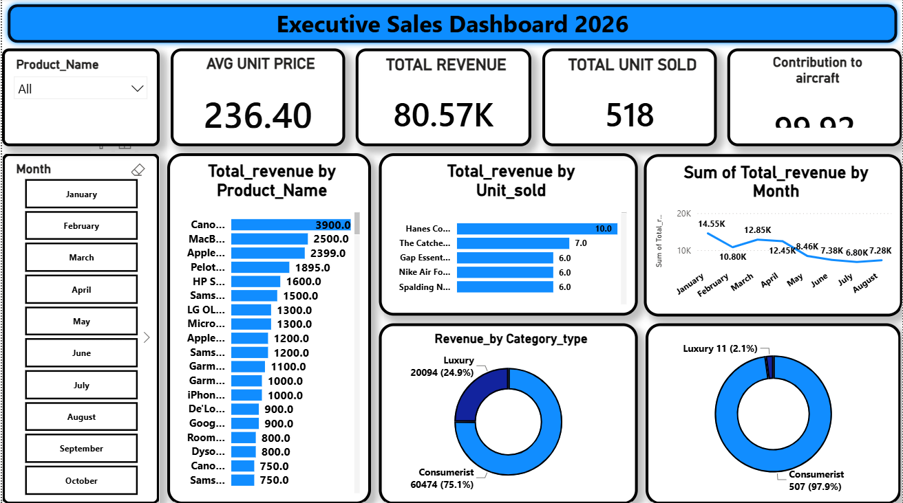

# Executive Sales Dashboard 2026

## Project Overview
This project provides a strategic analysis of sales performance for the year 2026. The objective was to clean, transform, and visualize complex sales data to support executive decision-making.

## Key Insights
- **Performance Trends:** Identified a Q2 sales decline linked to inventory gaps in luxury product offerings.
- **Portfolio Strategy:** Balanced high-volume 'Consumerist' sales with high-margin 'Luxury' items to optimize total revenue.
- **Strategic Recommendation:** Prioritized high-profit items like 'Canon' for targeted marketing to drive future profitability.

## Technologies Used
- **SQL Server:** For data modeling, classification (Luxury vs. Consumerist), and performance-optimized querying.
- **Power BI:** For interactive visualization and executive reporting.

## Dashboard Preview

## Data Logic
The SQL logic used for classifying products and calculating revenue contribution can be found in [Sales_View_Definition.sql](Sales_View_Definition.sql).
